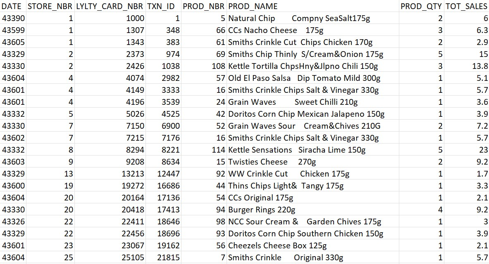
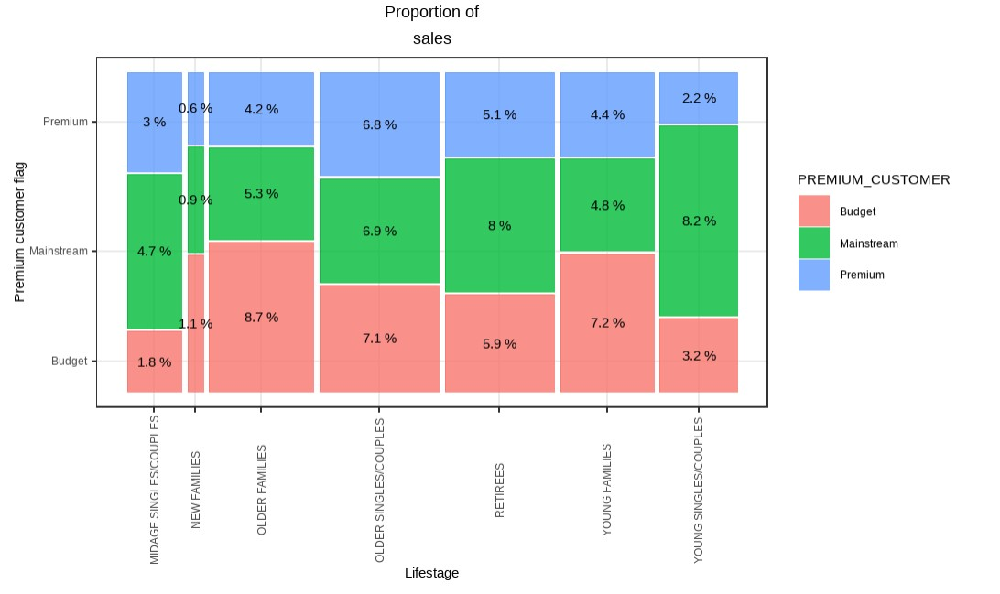
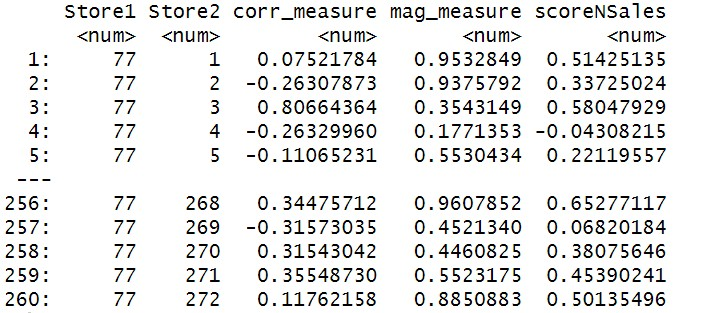

# Retail sales data analytics 
This project integrates transactional and customer-level data to generate actionable insights into customer segmentation, purchasing behaviour, and promotional effectiveness. By applying statistical methodologies and data-driven decision-making frameworks, the analysis supports strategic optimisation of retail operations and targeted marketing initiatives.

### Project background: 
 The Retail Analytics Team aims to better understand the customer segments purchasing chips and their buying behaviour within the region. Insights derived from this analysis will inform the supermarket's strategic planning for the chip category over the next six months, supporting more effective category management and promotional strategies.

#### skills implemented : R, EDA, visualisation, customer segmentation, statistical test, Pearson correlation, performance analysis, control-trial methodology, translating business requirements, reporting 
#### key insight delivered: customer value mapping, promotional ROI, Control Store Framework

resources: Forage - Quantum Data Analystics

#### dataset 1 - customer 
structure to analyse:  *Examine transaction data (clean data), Data analysis and customer segments, Deep dive into customer segments* 
data overview:  

 

EDA: 
As we particularly focus on chips, we can perform text analysis by summarising the individual words in the product name   

Next, filter out outliers/anomalies for each columns. And check the date for unsual pattern , it is found that there is an increase in purchases in December and a break in late December.  

The increase in sales occurs in the lead-up to Christmas and that there are zero sales on Christmas day itself. This is due to shops being closed on Christmas day.  

Next, we can move on to creating other features such as brand of chips or pack size 
  

## Examining customer data
before analysis, we can start by asking some questions   

- which group buy the most of chips, what is their avg money spent?
- is there buying pattern (time/seasonal?) 
- How many customers are there in each segment?   

Let’s start with calculating total sales by LIFESTAGE and PREMIUM_CUSTOMER and plotting the split by these segments to describe which customer segment contribute most to chip sales. 
 
Let’s see if the higher sales are due to there being more customers who buy chips or due to a higher basket value.   
 
There are more Mainstream - young singles/couples and Mainstream - retirees who buy chips.   
 
Older families and young families in general buy more chips per customer.   
 

Mainstream midage and young singles and couples are more willing to pay more per packet of chips compared to their budget and premium counterparts. This may be due to premium shoppers being more likely to buy healthy snacks and when they buy chips, this is mainly for entertainment purposes rather than their own consumption. This is also supported by there being fewer premium midage and young singles and couples buying chips compared to their mainstream counterparts.

As the difference in average price per unit isn’t large, we can check if this difference is statistically different.  
 
The t-test results in a p-value < 2.2e-16, i.e. the unit price for mainstream, young and mid-age singles and couples are significantly higher than that of budget or premium, young and midage singles and couples.  
 

Now let’s target specific customer segments that contribute the most to sales to retain them or further increase sales — Mainstream - young singles/couples.  
 

We can see that Mainstream young singles/couples are 23% more likely to purchase Tyrrells chips compared to the rest of the population. 

### conclusion:

Sales have mainly been due to Budget - older families, Mainstream - young singles/couples, and Mainstream retirees shoppers. 

1. high spend in chips for mainstream young singles/couples and retirees is due to there being more of them than other buyers. Mainstream, midage and young singles and
couples are also more likely to pay more per packet of chips. This is indicative of impulse buying behaviour.
2. Mainstream young singles and couples are 23% more likely to purchase Tyrrells chips
compared to the rest of the population. The Category Manager may want to increase the category’s performance by off-locating some Tyrrells and smaller packs of chips in discretionary space near segments where young singles and couples frequent more often to increase visibility and impulse behaviour.

To help the Category Manager with recommendations of where these segments are and further
help them with measuring the impact of the changed placement. We’ll work on measuring the impact of trials in the next task. 

### Task 2 

Question : test the impact of the new trial layouts with a data driven recommendation to whether or not the trial layout should be rolled out to all their stores

*examining the performance in trial vs control stores -  
step 1 : Select control stores ( explore the data and define metrics for your control store selection)  
step 2 : Assessment of the trial ( to know if the trial stores were successful or not )*

 store trial which was performed in stores 77, 86 and 88

consider the monthly sales experience of each store, match trial stores to control stores that are similar to the trial store prior to the trial period of Feb 2019 in terms of :

- total sales revenue
- total number of customers
- average number of transactions per customer

selected control stores —> compare each trial and control pair during the trial period —> test if total sales are significantly different —> check the driver of change

1. Filter to the pre‐trial period and stores with full observation periods
Now we need to work out a way of ranking how similar each potential control store is to the trial store. We can calculate how correlated the performance of each store is to the trial store.
2. Create a function to calculate correlation for a measure looping through each control store
Apart from correlation, we can also calculate a standardised metric based on the absolute difference between the trial store’s performance and each control store’s performance.
We’ll select control stores based on how similar monthly total sales in dollar amount and monthly number of customers are to the trial stores. So we will need to use our functions to get four scores, two for each of total sales and total customers.  

scoreNSales <- corr_measure * corr_weight + score_nSales$mag_measure * (1 - corr_weight)  
 

The store with the highest score is then selected as the control store since it is most similar to the trial store. (store 233) 
 
let’s check visually if the drivers are indeed similar in the period before the trial. We’ll look at total sales first. 
 

**Assessment of trial**

The trial period goes from the start of March 2019 to June 2019. We now want to see if there has been an uplift in over all chip sales.  We’ll start with scaling the control store’s sales to a level similar to control for any differences between the two stores outside of the trial period.
After we have comparable sales figures for the control store, we can calculate the percentage difference between the scaled control sales and the trial store’s sales during the trial period.

We can observe that the t-value is much larger than the 95th percentile value of the t-distribution for March and April- i.e. the increase in sales in the trial store in March and April is statistically greater than in the control store. Let’s create a more visual version of this by plotting the sales of the control store, the sales of the trial stores and the 95th percentile value of sales of the control store.

visual version of this by plotting the sales of the control store, the sales of the trial stores and the 95th percentile value of sales of the control store.
 

The results show that the trial instore77 is significantly different to its control store in the trial period as the trial store performance lies outside the 5% to 95% confidence interval of the control store in two of the three trial months. 

Repeat finding the control store and assessing the impact of the trial for each of the other two trial stores. 
Store 155  will  be a control store for trial store86.
Again, check visually if the drivers are indeed similar in the period before the trial, look at total sales first.

 
assess the impact of the trial on sales 
 
 

The results show that the trial in store86 is not significantly different to its control store in the trial period as the trial store performance lies inside the 5% to 95% confidence interval of the control store in two of the three trial months.

## **Conclusion** 

We’ve found control stores 233, 155, 237 for trial stores 77, 86 and 88 respectively. 

The results for trial stores 77 and 88 during the trial period show a significant difference in at least two of the three trial months but this is not the case for trial store86. We can check with the client if the implementation of the trial was different in trial store 86 but overall, the trial shows a significant increase in sales.
 
 

# Report - Wrap up task 1 & 2 

Summary : 
1. The number of chips transaction increases significantly prior to Christmas. Thus, added visibility via promotional display or Gondola end would increase driving sales growth over holiday period. 
2. Mainstream young single & couple are the primary shopper of chips. 
3. After implementing the change the performance of the trail store and the control store were compared. The trial store saw significant uplift. 
